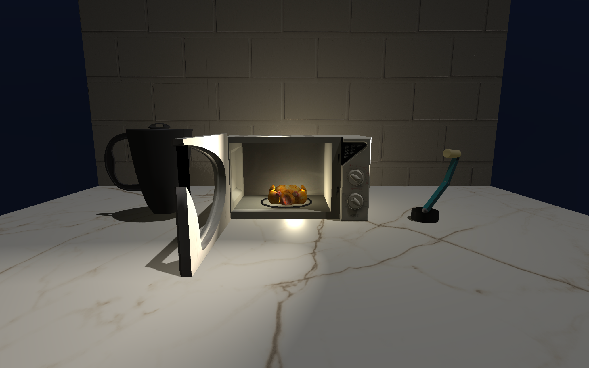

# OpenGL Microwave Simulation

Simulación 3D interactiva de una cocina nocturna desarrollada en **C++** con **OpenGL 3.3**. El elemento principal es un microondas funcional con puerta animada, plato giratorio, iluminación dinámica, cámaras interactivas y un sistema de partículas semitransparentes para representar vapor.

El proyecto fue desarrollado como trabajo individual para la asignatura de **Informática Gráfica** del Grado en Ingeniería Informática de la Universidad Rey Juan Carlos.



*Escena principal con la puerta animada abierta, iluminación interior, sombras y modelos 3D.*

## Características principales

- Apertura y cierre animado de la puerta del microondas.
- Lógica de funcionamiento: el microondas solo cocina con la puerta cerrada y se detiene al abrirla.
- Plato y pollo giratorios durante la cocción.
- Dos mandos interactivos para regular la intensidad de la luz interior y la cantidad de vapor.
- Sistema de partículas con transparencias y solape.
- Cámara orbital controlada con el ratón.
- Cámara interior para observar la escena desde dentro del microondas.
- Cámara frontal de presentación.
- Lámpara articulada construida mediante transformaciones jerárquicas.
- Iluminación global, direccional, posicional y focal.
- Foco de techo activable por teclado.
- Sombras dinámicas mediante **shadow mapping**.
- **Normal mapping** aplicado a la pared para simular relieve.
- Skybox nocturno implementado mediante **cube maps**.
- Modelos 3D externos en formato OBJ, materiales y texturas.

## Tecnologías utilizadas

- C++17
- OpenGL 3.3 Core Profile
- GLSL
- CMake 3.22+
- Docker
- GitHub Actions
- CLion
- GLFW
- GLEW
- GLM
- Assimp
- FreeImage

## Controles

| Entrada | Acción |
|---|---|
| `O` | Abrir o cerrar la puerta. Al abrirla, se detiene la cocción. |
| `S` | Iniciar o detener el microondas si la puerta está cerrada. |
| `C` | Activar o desactivar la cámara interior. |
| `V` | Activar o desactivar la cámara de presentación. |
| `U / J` | Girar el mando superior y modificar la intensidad de la luz interior. |
| `I / K` | Girar el mando inferior y modificar la cantidad de vapor. |
| `F` | Encender o apagar el foco del techo. |
| `L` | Encender o apagar la lámpara articulada. |
| `1 / 2` | Rotar la base de la lámpara. |
| `3 / 4` | Mover el primer brazo de la lámpara. |
| `5 / 6` | Mover el segundo brazo de la lámpara. |
| `7 / 8` | Mover el cabezal de la lámpara. |
| Ratón | Controlar la cámara orbital. |
| Rueda del ratón | Acercar o alejar la cámara. |
| `Esc` | Cerrar la aplicación. |

## Estructura del repositorio

```text
opengl-microwave-simulation/
├── .github/workflows/build.yml    # Compilación reproducible en CI
├── CMakeLists.txt                 # Configuración de compilación con CMake
├── Dockerfile                     # Build de verificación en Linux
├── src/                           # Código fuente principal
├── binary/
│   └── resources/
│       ├── models/                # Modelos 3D en formato OBJ
│       ├── textures/              # Texturas y mapas normales
│       └── shaders/               # Shaders GLSL
└── lib/                           # Dependencias y cabeceras incluidas
```

## Compilación portable

La configuración de CMake busca las dependencias instaladas en el sistema y no contiene rutas ligadas a una versión concreta de Homebrew. El ejecutable generado se llama `practica_micro` y se guarda en `binary/` para que pueda cargar los recursos mediante rutas relativas.

### macOS con Homebrew

Instala las dependencias:

```bash
brew install cmake glew glfw glm assimp freeimage
```

Configura y compila desde la raíz del repositorio:

```bash
cmake -S . -B build -DCMAKE_BUILD_TYPE=Release
cmake --build build --parallel
```

Si CMake no encuentra los paquetes en un Mac con Apple Silicon, indica el prefijo de Homebrew sin fijar ninguna ruta de versión:

```bash
cmake -S . -B build \
  -DCMAKE_BUILD_TYPE=Release \
  -DCMAKE_PREFIX_PATH="$(brew --prefix)"
```

Ejecuta la aplicación desde `binary/`, que contiene la carpeta `resources/`:

```bash
cd binary
./practica_micro
```

También se puede abrir el repositorio en CLion, seleccionar el target `practica_micro` y configurar `binary/` como directorio de trabajo.

### Linux

En Ubuntu 24.04 o una distribución compatible, instala:

```bash
sudo apt-get update
sudo apt-get install -y \
  build-essential cmake ninja-build \
  libglew-dev libglfw3-dev libglm-dev \
  libassimp-dev libfreeimage-dev libgl1-mesa-dev
```

Después configura y compila:

```bash
cmake -S . -B build -G Ninja -DCMAKE_BUILD_TYPE=Release
cmake --build build --parallel
```

### Compilación reproducible con Docker

El contenedor instala las dependencias en Ubuntu y compila el ejecutable, pero no intenta abrir la interfaz gráfica:

```bash
docker build -t opengl-microwave .
```

GitHub Actions ejecuta este mismo build en cada Pull Request y en cada cambio integrado en `main`.

## Entorno de desarrollo original

El proyecto se desarrolló originalmente con CLion en un MacBook Pro Intel con macOS Ventura. El build portable conserva ese flujo de trabajo, pero sustituye las rutas de Homebrew fijadas a versiones concretas por detección estándar de paquetes mediante CMake.

## Conceptos gráficos implementados

El proyecto aplica varios conceptos de programación gráfica en tiempo real:

- Transformaciones de modelado con matrices de traslación, rotación y escala.
- Objetos jerárquicos para la lámpara articulada.
- Materiales, texturas y mapas de normales.
- Iluminación con distintos tipos de fuentes de luz.
- Transparencias mediante `GL_BLEND`.
- Control del Z-buffer durante el renderizado del vapor.
- Animaciones temporizadas con GLFW.
- Shadow mapping.
- Cube maps y skybox.
- Cámaras orbital, interior y de presentación.

## Autor

**David Arévalo Rey**  
Grado en Ingeniería Informática — Universidad Rey Juan Carlos
